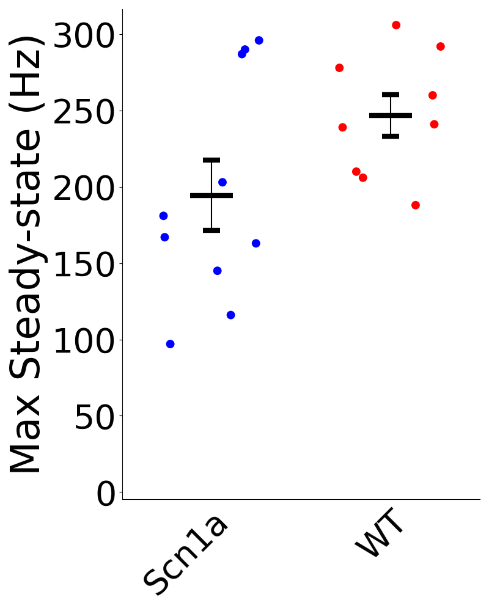
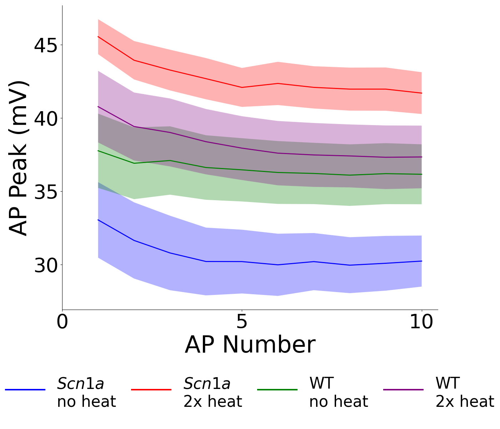
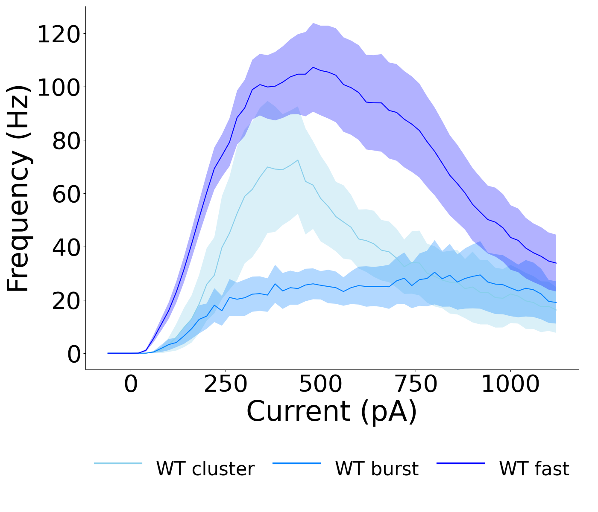
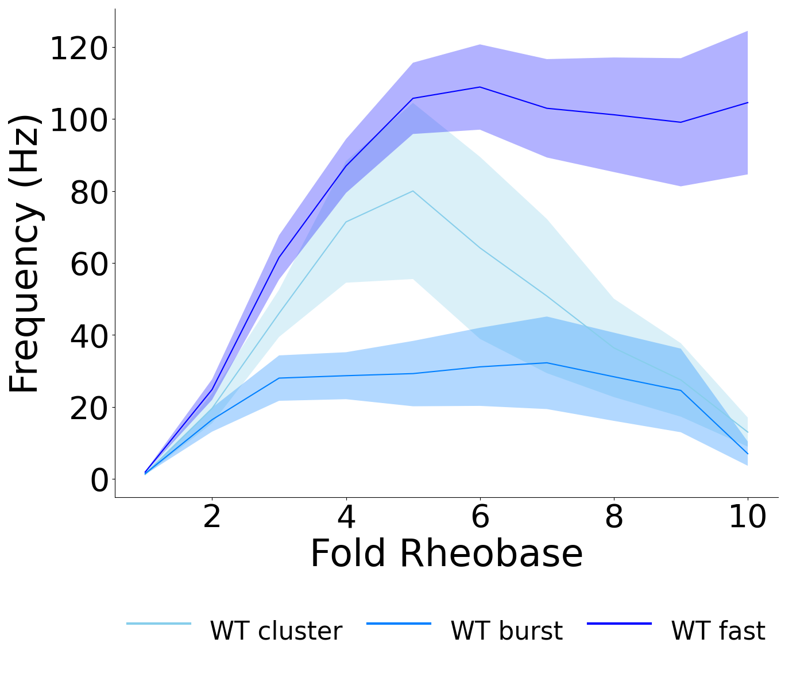
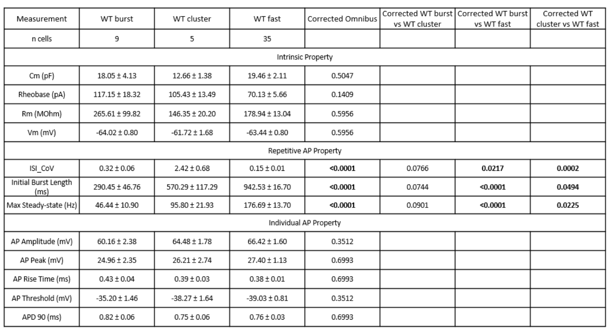

# Modular Analysis

A Python GUI application for automated statistical analysis of patch clamp electrophysiology data. The application extracts electrophysiological parameters from `.abf` files, runs appropriate statistical tests based on experimental design, and generates publication-style plots and results tables.

## Installation

Download the latest release for your operating system from the [Releases page](https://github.com/ydemetri/EphysAutomatedAnalysis/releases):

- **Windows**: `ModularAnalysis-windows.zip`
- **macOS**: `ModularAnalysis-macos.zip`
- **Linux**: `ModularAnalysis-linux.zip`

Extract the zip and run the `ModularAnalysis` executable inside. No Python installation required.

## Example Outputs

<p>





</p>

### Statistical Results Output as PowerPoint Table
<p>

</p>

## Expected Data Directory Structure

The application expects data organized in the following hierarchy:

```
data_directory/
    Group1/
        Brief_current/
            cell1.abf
            cell2.abf
            ...
        Membrane_test_vc/
            cell1.abf
            cell2.abf
            ...
        Gap_free/
            cell1.abf
            cell2.abf
            ...
        Current_steps/
            cell1.abf
            cell2.abf
            ...
    Group2/
        Brief_current/
        Membrane_test_vc/
        Gap_free/
        Current_steps/
    ...
```

Each group folder must contain one or more of these protocol subdirectories. Protocol subdirectories that are missing will be skipped during extraction. The four protocols and what they provide:

| Protocol Directory | Recording Type | Parameters Extracted |
|---|---|---|
| `Brief_current` | Brief current injection (current clamp) | AHP Amplitude |
| `Membrane_test_vc` | Voltage clamp test pulse | Input Resistance (Rm), Membrane Capacitance (Cm) |
| `Gap_free` | Gap-free current clamp | Resting Membrane Potential (Vm) |
| `Current_steps` | Current clamp step protocol | All firing properties, AP properties, time constant, sag, rheobase, attenuation, current-frequency relationship |

## Application Workflow

The GUI has four tabs, used sequentially:

### Tab 1: Data Discovery

1. Click **Browse** or type the path to your data directory.
2. Click **Scan Directory**. The app discovers group folders containing protocol subdirectories with `.abf` files.
3. Detected groups and their file counts are displayed.

### Tab 2: Data Extraction

1. Click **Extract Data**. The app processes every `.abf` file in each protocol directory for every discovered group.
2. A progress bar and detailed log show extraction status.
3. Extracted data is saved as CSV files in a `Results/` folder within the data directory.

### Tab 3: Measurement Selection

Select which measurements to include in statistical analysis. Measurements are organized into three categories:

- **Intrinsic Properties**: Vm, Rm, Cm, Time Constant, Sag, Rheobase
- **Repetitive AP Properties**: Max Instantaneous Frequency, Max Steady-state Frequency, ISI CoV, SFA10, SFAn, Initial Burst Length, Maximal Burst Length
- **Individual AP Properties**: AP Peak, AP Threshold, AP Amplitude, AP Rise Time, AP Half-Width, APD 50, APD 90, AHP Amplitude

Selecting fewer measurements reduces the multiple comparison correction penalty (FDR is applied within each category).

### Tab 4: Statistical Analysis

1. Set **Protocol Parameters** (must match the actual recording protocol):
   - **Min Current (pA)**: Minimum current for the current step protocol (default: -60).
   - **Step Size (pA)**: Step size between current injections (default: 20).
   These values are used to reconstruct current values for frequency plots and to compute fold rheobase normalization. Incorrect values will produce wrong current axes and fold rheobase ratios. This is necessary because the abf files themselves generally report incorrect current values because of noise. 
2. Choose an **Experimental Design** (see below).
3. Move groups from **Available** to **Selected** by clicking on them.
4. Set **Group Properties** (color, italic label) for each selected group.
5. Click **Run Analysis** (some designs require extra input after this step and each is explained under that specific design).

---

## Experimental Designs

### 1. Two Independent Groups

**Use when**: Comparing two unrelated groups (e.g., WT vs. KO).

**Requirements**: Exactly 2 selected groups.

**Tests performed**:
- Per measurement: Welch's t-test (parametric) or Mann-Whitney U (non-parametric).
- Frequency analysis: Point-by-point unpaired tests at each current step and fold rheobase step; global mixed-effects model.
- Attenuation analysis: Point-by-point unpaired tests at each AP number; global mixed-effects model.

**No manifest required.**

### 2. Three or More Independent Groups

**Use when**: Comparing 3+ unrelated groups (e.g., WT vs. Het vs. KO).

**Requirements**: 3+ selected groups.

**Tests performed**:
- Per measurement: Welch's one-way ANOVA (parametric) or Kruskal-Wallis (non-parametric). Post-hoc pairwise comparisons run only if the FDR-corrected omnibus test is significant.
- Frequency analysis: Point-by-point one-way ANOVA at each current/fold rheobase step; global mixed-effects model.
- Attenuation analysis: Point-by-point one-way ANOVA at each AP number; global mixed-effects model.

**No manifest required.**

### 3. Factorial Design (N x M)

**Use when**: You have two independent (between-subjects) factors (e.g., Genotype x Treatment) forming an N x M grid.

**Requirements**: 4+ selected groups. The number of groups must equal N x M. A dialog prompts you to:
- Name each factor (e.g., "Genotype", "Treatment").
- Assign each group to a combination of factor levels.
- Optionally italicize specific factor levels on plots.

**Tests performed**:
- Per measurement: Two-way ANOVA testing Factor 1, Factor 2, and their Interaction. If the FDR-corrected interaction is significant, simple effects post-hocs are run. If a corrected main effect is significant and that factor has 3+ levels, marginal pairwise comparisons are run.
- Frequency analysis: Point-by-point two-way ANOVA at each step; global mixed-effects model with 3-way interactions (Factor1 x Factor2 x continuous predictor).
- Attenuation analysis: Same approach as frequency.

**Note**: Factorial designs always use parametric tests (ANOVA). There is no non-parametric fallback for this design yet.

**No manifest required.**

### 4. Paired Design (2 Groups)

**Use when**: The same subjects are measured under two conditions (e.g., before vs. after treatment).

**Requirements**: Exactly 2 selected groups. **Requires an Excel manifest.**

**Tests performed**:
- Per measurement: Paired t-test (parametric) or Wilcoxon signed-rank (non-parametric), using subject-matched pairs from the manifest.
- Frequency analysis: Point-by-point paired t-tests at each step; global mixed-effects model with subject as random effect.
- Attenuation analysis: Point-by-point paired t-tests at each AP number; global mixed-effects model.

#### Manifest Structure (Paired Design)

The manifest is an Excel file (`.xlsx`) in **wide format**:

| Subject_ID | Condition1 | Condition2 |
|---|---|---|
| Mouse1 | file_a.abf | file_b.abf |
| Mouse2 | file_c.abf | file_d.abf |

- The first column must be the subject identifier.
- Remaining column names must **exactly match** the folder names of the selected groups.
- Each cell contains the `.abf` filename for that subject under that condition. The `.abf` extension is added automatically if missing.

### 5. Repeated Measures (3+ Groups)

**Use when**: The same subjects are measured under three or more conditions (e.g., three temperatures).

**Requirements**: 3+ selected groups. **Requires an Excel manifest** (same format as Paired Design, with more condition columns).

**Tests performed**:
- Per measurement: Repeated measures ANOVA (parametric, with Greenhouse-Geisser or Huynh-Feldt sphericity corrections) or Friedman test (non-parametric). Post-hoc pairwise comparisons run only if the FDR-corrected omnibus test is significant.
- Frequency analysis: Point-by-point RM-ANOVA at each step; global mixed-effects model.
- Attenuation analysis: Point-by-point RM-ANOVA at each AP number; global mixed-effects model.

#### Manifest Structure (Repeated Measures)

Same as the Paired Design manifest, but with 3+ condition columns:

| Subject_ID | Condition1 | Condition2 | Condition3 |
|---|---|---|---|
| Mouse1 | file_a.abf | file_b.abf | file_c.abf |
| Mouse2 | file_d.abf | file_e.abf | file_f.abf |

Column names must exactly match folder names.

### 6. Mixed Factorial Design

**Use when**: You have both a between-subjects factor (e.g., Genotype) and a within-subjects factor (e.g., Temperature) with repeated measures.

**Requirements**: 4+ selected groups. **Requires an Excel manifest.** Folder names must follow the format `{Condition}_{Group}` or `{Condition} {Group}` (e.g., `32_Scn1a`, `32 Scn1a`).

**Tests performed**:
- Per measurement: Mixed ANOVA testing Between factor, Within factor, and their Interaction. If the FDR-corrected interaction is significant, simple effects comparisons are run (paired tests within between-factor levels, independent tests within within-factor levels).
- Frequency analysis: Point-by-point mixed ANOVA at each step; global mixed-effects model with 3-way interactions.
- Attenuation analysis: Same approach as frequency.

**Note**: Mixed factorial designs always use parametric tests (mixed ANOVA). There is no non-parametric fallback for this design yet.

#### Manifest Structure (Mixed Factorial)

The manifest is an Excel file with subjects as rows and conditions as columns:

| Subject_ID | Group | 32 | 37 | 42 |
|---|---|---|---|---|
| Scn1a_1 | Scn1a | file1 | file2 | file3 |
| Scn1a_2 | Scn1a | file4 | file5 | file6 |
| WT_1 | WT | file7 | file8 | file9 |
| WT_2 | WT | file10 | file11 | file12 |

- **Subject_ID**: First column. Unique identifier for each subject.
- **Group** (optional): The between-subjects group. If omitted, the group is inferred from `Subject_ID` by splitting on `_` or `-` (e.g., `Scn1a_1` -> group `Scn1a`).
- **Condition columns**: Remaining columns. Headers must match the condition part of the folder names (e.g., `32`, `37`, `42`).
- **Cell values**: `.abf` filenames (extension added automatically if missing).

A dialog prompts you to:
- Upload the manifest.
- Name the between-subjects factor (e.g., "Genotype") and within-subjects factor (e.g., "Temperature").
- Optionally italicize specific factor levels on plots.

---

## How Statistical Tests Are Chosen

### Parametric vs. Non-Parametric Decision

For each measurement, the app decides between parametric and non-parametric tests using distribution shape criteria based on Curran, West & Finch (1996):

1. If **any group has n < 10**: use non-parametric (sample too small to assess assumptions).
2. If **any group has |skewness| > 2 or |kurtosis| > 7**: use non-parametric (severe non-normality).
3. Otherwise: use parametric (with Welch correction for unequal variances where applicable).

This replaces Shapiro-Wilk testing, which is overpowered for large samples and underpowered for small ones.

### Multiple Comparison Correction

FDR correction (Benjamini-Hochberg) is applied **within each measurement category**:
- Intrinsic Properties (6 measurements)
- Repetitive AP Properties (7 measurements)
- Individual AP Properties (8 measurements)

Selecting fewer measurements reduces the correction penalty. For factorial designs, FDR is applied separately by effect type (main effects, interaction, post-hocs).

### Post-Hoc Testing Logic

- **Two-group designs**: No post-hocs needed (omnibus = pairwise).
- **Multi-group designs**: Post-hocs run only if the FDR-corrected omnibus test is significant (p < 0.05). Parametric post-hocs use pairwise Welch's t-tests; non-parametric post-hocs use Dunn's test (after Kruskal-Wallis) or pairwise Wilcoxon signed-rank tests (after Friedman).
- **Factorial designs**: If the FDR-corrected interaction is significant, simple effects comparisons are run (pairwise t-tests within each factor level). If a corrected main effect is significant and that factor has 3+ levels, marginal mean comparisons (t-tests on least-squares means) are run. Main effects with only 2 levels do not need post-hocs.
- **Mixed factorial**: If the FDR-corrected interaction is significant, paired t-tests compare within-factor levels within each between-factor group, and independent t-tests compare between-factor groups within each within-factor level.

### Mixed-Effects Models

For frequency and attenuation analyses, in addition to point-by-point tests, a global mixed-effects model is fit across all steps/AP numbers. This provides a unified test of the entire curve rather than individual points. The model includes:
- Fixed effects: Group (and Factor interactions for factorial designs), the continuous predictor (current, fold rheobase, or AP number), and their interactions.
- Random effects: Random intercepts and slopes per cell (subject).

Post-hoc contrasts use Wald tests on the fitted model.

---

## Linear Mixed Models (Optional)

By default, the application uses classical statistical tests (t-tests, ANOVAs) that treat each cell as an independent observation. However, in patch clamp experiments multiple cells are often recorded from the same mouse, violating the independence assumption and inflating Type I error rates.

**Linear Mixed Models (LMMs)** account for this nested structure by modeling mouse as a random effect, correctly partitioning within-mouse and between-mouse variance. This is the statistically appropriate approach when you have multiple cells per mouse.

### Requirements

LMMs require [R](https://www.r-project.org/) to be installed on your system. The required R packages (`lmerTest` and `emmeans`) are installed automatically on first use.

**Windows:**
1. Download R from https://cran.r-project.org/bin/windows/base/
2. Run the installer. **Important**: when prompted, check **"Add R to PATH"** (or "Save version number in registry").
3. Download and install Rtools from https://cran.r-project.org/bin/windows/Rtools/ (required for compiling R packages from source).
4. Restart the application after installing R and Rtools.

**macOS:**
1. Download the `.pkg` installer from https://cran.r-project.org/bin/macosx/
2. Run the installer (R is added to PATH automatically).
3. Alternatively: `brew install r` if you use Homebrew.
4. Install Xcode Command Line Tools if not already installed (required for compiling R packages from source): `xcode-select --install`

**Linux (Debian/Ubuntu):**
```
sudo apt install r-base build-essential
```

**Linux (Fedora/RHEL):**
```
sudo dnf install R gcc gcc-c++ make
```

If R is not installed or cannot be found, the application silently falls back to classical tests for all measurements.

### Mouse Log CSV

To use LMMs, you need a **mouse log** CSV file that maps each recording file to the mouse it came from. The format is:

| Filename | Mouse_ID |
|---|---|
| 2024_03_14_0020.abf | WT_mouse1 |
| 2024_03_14_0021.abf | WT_mouse1 |
| 2024_03_14_0022.abf | KO_mouse2 |

- **Filename**: The recording filename; you can include or omit the `.abf` extension (both work).
- **Mouse_ID**: An identifier for the mouse. Multiple cells from the same mouse share the same ID.

Every `.abf` file used in the analysis must appear in the mouse log.

### Enabling LMMs

In **Tab 4 (Statistical Analysis)**, check **"Account for mouse clustering"**. This reveals a file picker where you select your mouse log CSV. The analysis then uses LMMs wherever possible, falling back to classical tests for individual measurements where the LMM fails to converge.

### Statistical Model

All designs use an LMM with a random intercept for Mouse_ID to account for within-mouse correlation. For paired, repeated measures, and mixed factorial designs, a nested random intercept for Cell_ID within Mouse_ID is also included. Omnibus p-values use Satterthwaite degrees of freedom. Post-hoc comparisons use estimated marginal means (`emmeans`) rather than raw pairwise t-tests. FDR correction is applied identically to the classical pathway.

### Fallback Behavior

LMMs can fail for individual measurements (e.g., too few mice, singular model fit, convergence failure). When this happens, that specific measurement automatically falls back to the corresponding classical test. Other measurements that fit successfully still use LMM results. This means a single analysis run can contain a mix of LMM and classical results -- the `Test_Type` column in `Stats_parameters.csv` indicates which method was used for each measurement.

### Result Labeling

LMM results are labeled differently from classical results in the output:

- **Omnibus tests**: Named "Linear Mixed Model", "Linear Mixed Model (one-way)", etc. instead of "t-test", "One-way ANOVA", etc.
- **Post-hoc comparisons**: Named "LMM contrast" or "LMM simple effect" instead of "t-test" or "pairwise t-test".
- **Test_Type column**: Shows the LMM variant used, making it clear which statistical method produced each result.

---

## Output Files

All outputs are saved in a `Results/` folder within the data directory:

### Extracted Data CSVs
- `Calc_{Group}_afterhyperpolarization.csv` - AHP amplitude per cell
- `Calc_{Group}_membrane_properties.csv` - Rm and Cm per cell
- `Calc_{Group}_resting_potential.csv` - Vm per cell
- `Calc_{Group}_current_step_parameters.csv` - All current step parameters per cell
- `Calc_{Group}_frequency_vs_current.csv` - Current vs. frequency data (wide format)
- `Calc_{Group}_frequency_vs_fold_rheobase.csv` - Fold rheobase vs. frequency data (wide format)
- `Calc_{Group}_attenuation.csv` - AP peak voltage vs. AP number (wide format)

### Statistical Results
- `Stats_parameters.csv` - Main statistical results per measurement
- `Stats_parameters_table.pptx` - Publication-style PowerPoint table with mean +/- SE, corrected p-values, and significant results bolded
- `Stats_across_frequencies_global_mixed_effects.csv` - Mixed-effects model results for frequency and attenuation
- `Stats_across_frequencies_global_mixed_effects_posthocs.csv` - Post-hoc contrasts from global models

### Plots
- Scatter plots for each selected measurement (one per measurement)
- Current vs. frequency and fold rheobase vs. frequency line plots
- AP attenuation plot (AP number vs. peak voltage)
- Burst analysis plot (ISI CoV vs. initial burst length)

### Log File
- `analysis_{timestamp}.log` - Detailed log of the analysis run

---

## How Each Parameter Is Calculated

### Intrinsic Properties

#### Resting Membrane Potential (Vm, mV)
**Protocol**: Gap-free current clamp.
**Calculation**: Mean voltage across the entire gap-free recording trace (single sweep).

#### Input Resistance (Rm, MOhm)
**Protocol**: Voltage clamp test pulse.
**Calculation**: `R = ΔV / ΔI`. A tophat fit identifies the voltage step onset and offset. The mean current is measured during the middle 50% of the driven period and the middle 50% of the post-drive resting period. The resistance is the applied voltage step divided by the difference in steady-state currents. Values from all sweeps in a file are averaged.

#### Membrane Capacitance (Cm, pF)
**Protocol**: Voltage clamp test pulse.
**Calculation**: Uses the exponential fit method:
1. The capacitive transient at voltage step onset is isolated.
2. The 20%-80% amplitude region of the decaying transient is fit with an exponential: `I(t) = A · exp(-t / τ)`.
3. The amplitude is extrapolated back to t=0 (step onset): `A₀ = A_fit · exp(t_fit / τ)`.
4. Total charge `Q = A₀ · τ` (integral of the exponential from 0 to ∞).
5. `Cm = Q / ΔV` (charge divided by the voltage step size).
Values from all sweeps are averaged. Returns NaN if the fit fails validation (τ hits bounds, extrapolation unstable, or voltage step < 0.5 mV).

#### Time Constant (τ, ms)
**Protocol**: Current steps (first sweep, which should be hyperpolarizing).
**Calculation**: Single exponential fit to the voltage response during a hyperpolarizing current step:
1. Baseline voltage is calculated from the pre-stimulus interval.
2. The peak hyperpolarizing deflection is found.
3. Signal-to-noise ratio is checked (requires `|baseline − peak| / σ_baseline ≥ 10`).
4. A fit window is defined starting where voltage reaches 5% of the peak deflection from baseline.
5. An exponential `y = y₀ + a · exp(-t / τ)` is fit using least-squares.
6. Returns τ in ms. Returns NaN if the voltage deflection is < 1 mV, SNR is too low, or fit RMSE exceeds 1.0 mV.

#### Sag
**Protocol**: Current steps (first sweep, which should be hyperpolarizing).
**Calculation**: `Sag = V_steady / V_peak`, where:
- `V_peak` is the maximum hyperpolarizing voltage deflection.
- `V_steady` is the mean voltage over the last 100 ms of the current step.

A sag ratio < 1 indicates the presence of hyperpolarization-activated currents (Ih). Only calculated when the first sweep has a sufficiently hyperpolarizing current (< −5 pA).

#### Rheobase (pA)
**Protocol**: Current steps.
**Calculation**: The drive current of the first sweep (lowest current) that elicits at least 1 action potential. Sweeps are iterated from lowest to highest current. The drive current is extracted via a tophat fit to the input signal.

### Repetitive AP Properties

All repetitive firing properties are measured from the current steps protocol.

#### Max Steady-State Firing Frequency (Hz)
The highest mean firing frequency across all sweeps. Mean firing frequency for a sweep = `n_APs / t_stimulus`. Only valid APs (peak > 0 mV) are counted; peaks between −20 mV and 0 mV are classified as failed APs and excluded from the count.

#### Max Instantaneous Firing Frequency (Hz)
The inverse of the shortest interspike interval (ISI) across all sweeps: `f_max = 1 / ISI_min`. Represents the fastest pair of consecutive spikes.

#### Spike Frequency Adaptation (SFA10, SFAn)
Measured from the sweep with the most APs (minimum 11 APs required):
- `SFA10 = ISI₁ / ISI₁₀` (ratio of first to tenth interspike interval).
- `SFAn = ISI₁ / ISIₙ` (ratio of first to last interspike interval).

Values > 1 indicate acceleration (later ISIs are shorter); values < 1 indicate adaptation/deceleration (later ISIs are longer).

#### ISI Coefficient of Variation (ISI_CoV)
Measured from the sweep with the highest steady-state firing frequency:

`ISI_CoV = σ(ISI) / μ(ISI)`

Higher values indicate more irregular firing patterns.

#### Initial Burst Length (ms)
Measured from the max steady-state firing frequency sweep. A burst gap is defined as an ISI exceeding `μ(ISI) + 3σ(ISI)`. The initial burst length is the time from the first AP to the AP immediately before the first burst gap. If no gap exists, it spans the entire AP train.

#### Maximal Burst Length (ms)
The duration of the longest continuous burst (segment of consecutive APs with no inter-burst gaps). Uses the same gap threshold as initial burst length.

### Individual AP Properties

Unless otherwise noted, individual AP properties are measured from the **first action potential** at the rheobase sweep (first suprathreshold current injection) in the current steps protocol.

#### AP Threshold (mV)
The membrane voltage at which dV/dt first reaches 10,000 mV/s (10 V/s) during the upstroke of the first AP. This is the standard rate-of-rise criterion for AP threshold detection.

#### AP Peak (mV)
The peak voltage of the first AP.

#### AP Amplitude (mV)
`AP Amplitude = V_peak − V_threshold`. The voltage excursion from threshold to peak.

#### AP Rise Time (ms)
Time from AP threshold to AP peak: `t_peak − t_threshold`.

#### AP Half-Width (ms)
The width of the first AP at half-maximal amplitude. Half-max voltage = `(V_peak + V_threshold) / 2`. The half-width is the time between the upstroke and downstroke crossings of this voltage level.

#### APD 50 (ms)
Action potential duration at 50% repolarization. Measured as the time from the AP threshold crossing (upstroke) to when the voltage has repolarized 50% of the way from peak back to threshold.

#### APD 90 (ms)
Action potential duration at 90% repolarization. Measured as the time from the AP threshold crossing (upstroke) to when the voltage has repolarized 90% of the way from peak back to threshold.

#### AHP Amplitude (mV)
**Protocol**: Brief current injection.
**Calculation**: Measured from the first sweep that elicits exactly 1 AP:
1. The baseline voltage is calculated from the pre-stimulus period.
2. The output signal is smoothed with a Gaussian filter (σ = 3).
3. The minimum voltage in the 100 ms window after the AP peak is found.
4. `AHP = V_baseline − V_min_post-AP`.
5. Returns 0 if the post-AP minimum is not lower than the pre-AP minimum (no true hyperpolarization).

### Frequency and Attenuation Analyses

#### Current vs. Frequency
For each current injection step, the steady-state firing frequency is computed (`f = n_APs / t_stimulus`). Only positive current steps are analyzed (steps ≤ 0 pA are skipped). This is analyzed across groups at each step and via a global mixed-effects model with current as a continuous predictor. Point-by-point tests at a given step require at least 3 cells per group at that step; steps with insufficient data are skipped.

#### Fold Rheobase vs. Frequency
Same as current vs. frequency, but the x-axis is normalized to each cell's rheobase (`I / I_rheobase`). This controls for differences in excitability across cells. Only fold values up to 10x rheobase are analyzed. Point-by-point tests and the plot use only integer folds (1-10); the mixed-effects model uses all fold values (including fractional) up to 10x.

#### AP Attenuation
From sweep 10 of the current steps protocol, the peak voltage of each successive AP is extracted. This captures voltage attenuation during sustained firing. Each group must have at least 5 cells with ≥10 APs in sweep 10 for the analysis to run. Analysis uses the first 10 APs, running point-by-point tests at each AP number (1-10) and a global mixed-effects model with AP number as a continuous predictor.

### Action Potential Detection

An action potential is detected when the output voltage crosses above the threshold (default 0 mV) and the peak is below a ceiling (default 100 mV). Peaks between −20 mV and 0 mV are flagged as "failed APs" and not counted in any properties. Only APs occurring within the stimulus interval and during positive current injection (≥ 5 pA) are counted.
